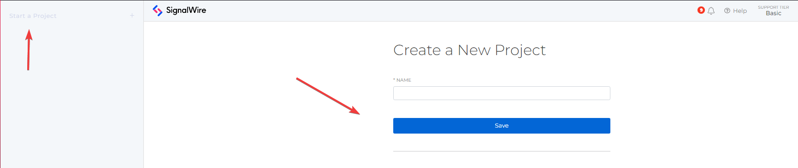
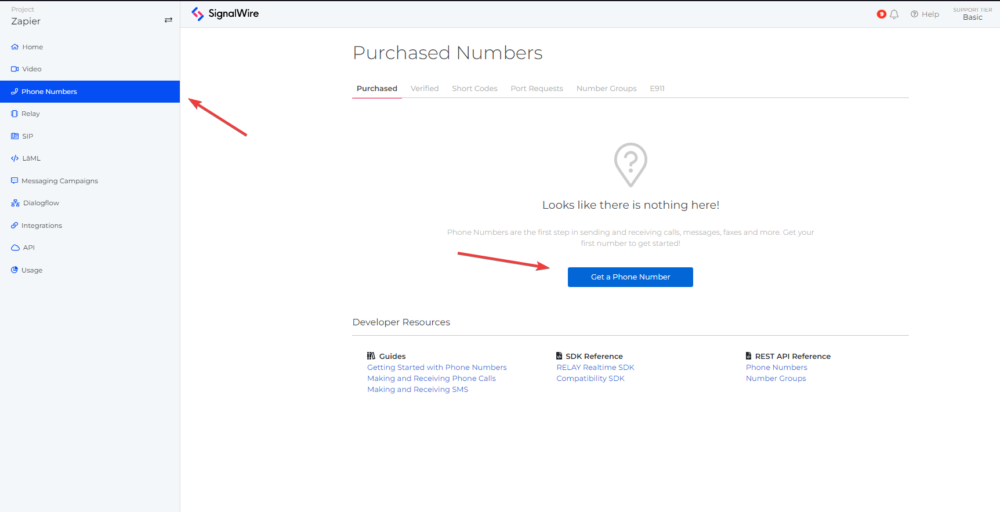
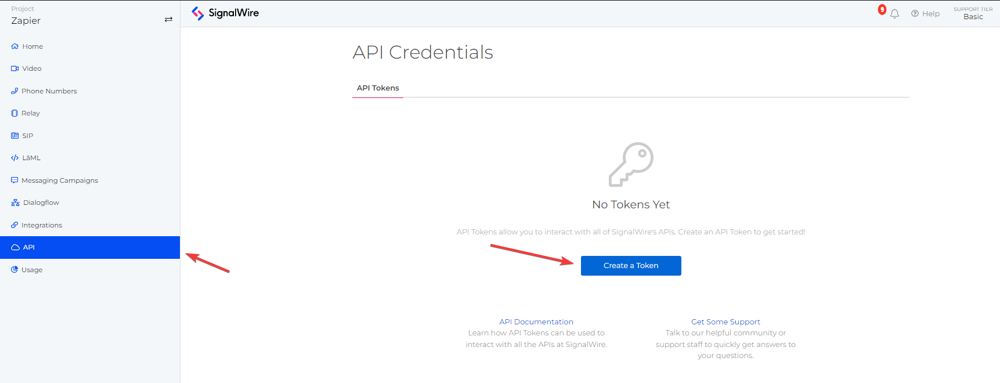
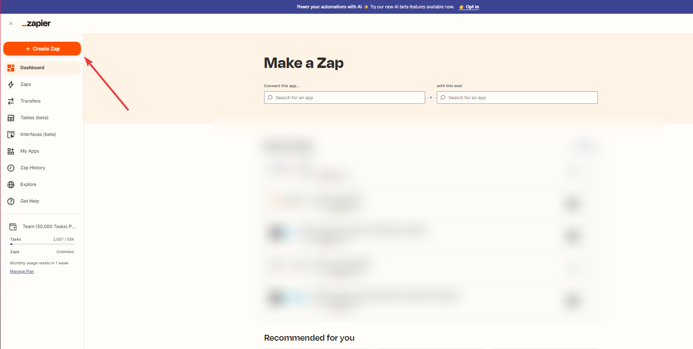
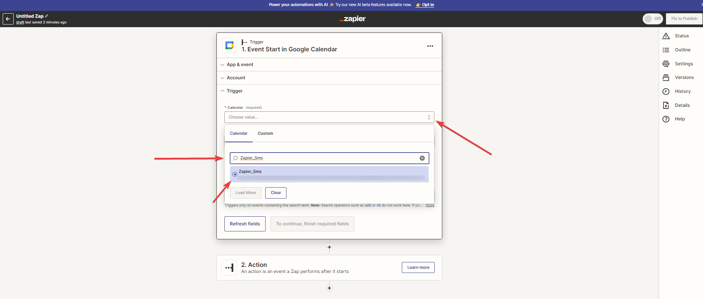
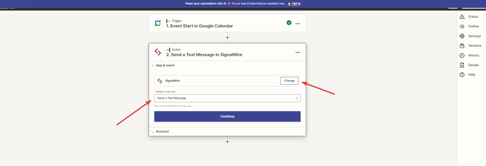
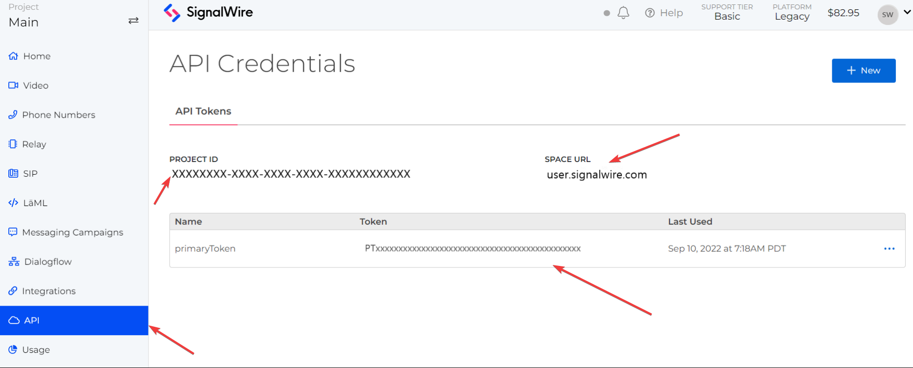
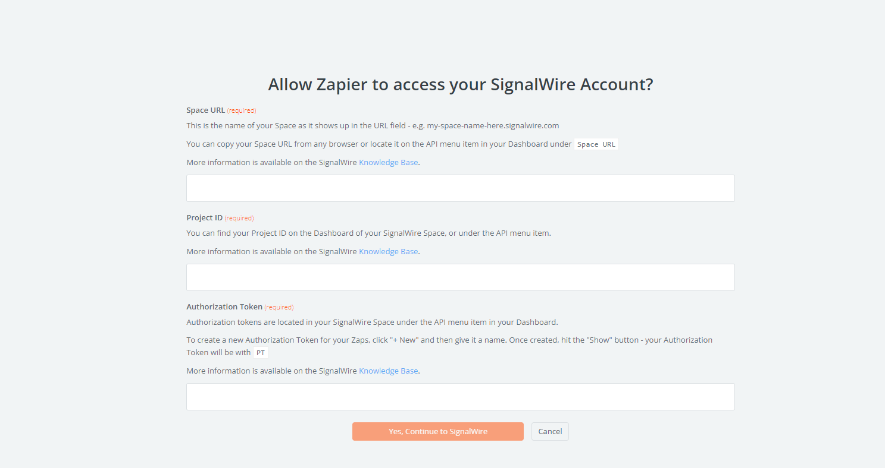
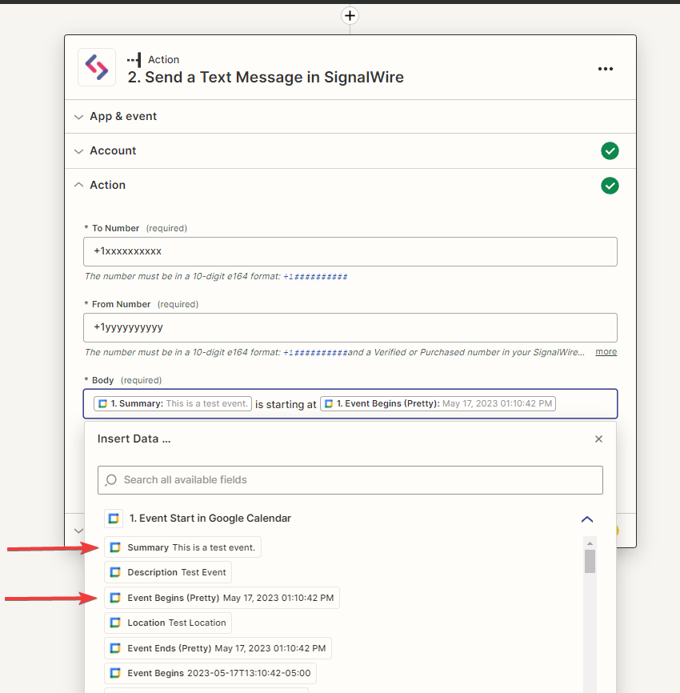
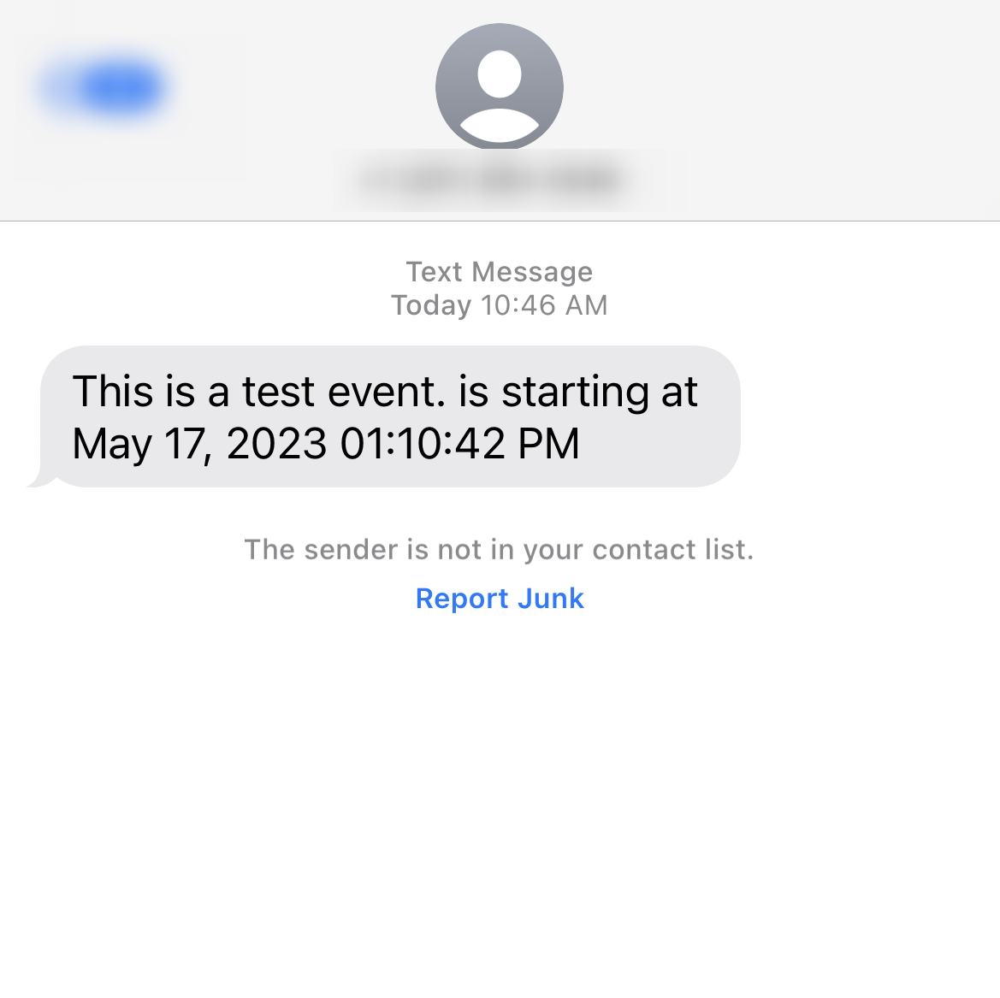

# Zapier Signalwire Integration: Google Calendar SMS Reminders

This guide will help you create a Zapier integration with SignalWire. This integration will enable you to receive SMS reminders at the beginning of each Google Calendar event. This feature is currently in early access phase of the public beta.

## What you need to get started
- [Zapier](https://zapier.com/sign-up) account
- [SignalWire Space](https://developer.signalwire.com/guides/signing-up-for-a-space/) account

## Step-by-Step Guide

### 1. Set Up a New Project on SignalWire

Create a new project on SignalWire. Click the project switcher located at the top left of the page and name your project "Zapier".

### 2. Get a New Phone Number on SignalWire
##### Note: If you already have a SignalWire number you would like to use for this integration, skip to step 3.

First we will need to go to the "Phone Numbers" page. In the left menu, click on the "Phone Numbers" section.

Next, you will want to purchase a number, you can do this by clicking the "+ New" button in the top right corner if you already have a number or
click on the "Get a Phone Number" button if you don't already have a number. Choose a local or Toll-Free number to purchase.

**Important:**
- For 10DLC(local) Numbers: If you are sending messages to the US, make sure to register your traffic with the [Campaign Registry](https://developer.signalwire.com/guides/campaign-registry-all-you-need-to-know/).
- For Toll-Free Numbers: Check that the SMS capability is enabled by going into the numbers settings and seeing if SMS is under the capabilities section.
If not, you will need to [verify your number](https://developer.signalwire.com/guides/toll-free-number-overview/#what-is-toll-free-verification) to have SMS capabilities.

### 3. Create an API Token on SignalWire

Navigate to "API" on the left menu and click "+ New". Name your token and click "Save". Keep this page open for the upcoming Zapier setup.

### 4. Set Up Zapier Trigger for Google Calendar

Go to Zapier, click "Create Zap", this will open a new page asking you to select a Zap trigger.
Choose "Google Calendar" in the trigger menu or type Google Calendar in the search bar if you do not see it, this should pop up the option.
Follow the instructions to sign in to Google if necessary.

Next, pick the calendar you want to use for the SMS reminders. In this example I wil be using my Google Calendar named `Zapier_Sms`.

Fill in the required fields and click "Continue".

Check that the trigger works by testing it before moving on.

### 5. Configure Zapier Action with SignalWire

Search for "SignalWire" under "Choose App & Event". Select "Send a Text Message" and click "Continue".

To sign in to SignalWire, input your Space URL, Project ID, and Authorization Token from the SignalWire API page.

After linking your SignalWire Space, customize your SMS. The "To Number" should be your phone number and the "From Number" should be the SignalWire number you purchased.

In the body, write your reminder message and insert dynamic fields for the event summary and start time. For example, you could use:   
`{{Summary of Event}} is starting at {{Start_Time of Event}}`

Test your zap to confirm everything is working correctly. If everything is set up correctly, you should receive an SMS reminder for your upcoming Google Calendar events.

## Wrapping up

Congratulations! You've successfully created a Zapier integration with SignalWire to send SMS reminders for your Google Calendar events. Enjoy staying on top of your schedule!

